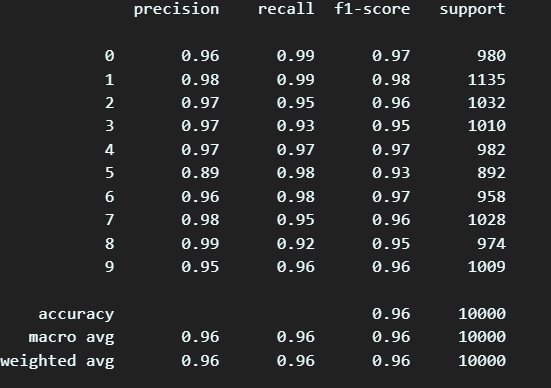
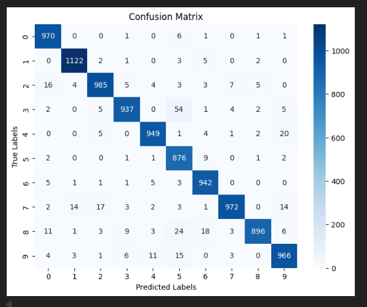

# Handwritten Digit's Classifier Using MNIST Data

A PyTorch-based neural network that classifies handwritten digits (0–9) from the [MNIST dataset](http://yann.lecun.com/exdb/mnist/).  
This project demonstrates how to:
- Load datasets using `torchvision`
- Preprocess data with normalization
- Create and train a feed-forward neural network
- Evaluate model accuracy

---

## 📌 What This Code Does

1. **Load the MNIST Dataset**  
   - Uses `torchvision.datasets.MNIST`  
   - Applies a transform: converts images to tensors & normalizes pixel values from `0-255` to a range centered at `0`  
   - Splits into **training set (60,000 images)** and **test set (10,000 images)**

2. **Create Data Batches**  
   - Uses `DataLoader` to batch the dataset into groups of 64 images  
   - Shuffles the training set for better generalization  
   - Keeps test set order fixed for consistent evaluation

3. **Define the Neural Network**  
   - A feed-forward **fully connected network**:
     - Input: Flattened 28×28 pixels (784 features)
     - Hidden layer 1: 128 neurons + ReLU activation
     - Hidden layer 2: 64 neurons + ReLU activation
     - Output: 10 neurons (one per digit) without activation (softmax handled by `CrossEntropyLoss`)
   - Implemented as a subclass of `nn.Module`

4. **Train the Model**  
   - **Loss Function:** CrossEntropyLoss (multi-class classification)  
   - **Optimizer:** Adam (learning rate = 0.001)  
   - **Training loop:**  
     - For each epoch:
       1. Forward pass: feed images to the network  
       2. Compute loss  
       3. Backward pass: calculate gradients  
       4. Update weights using optimizer  
     - Prints average loss per epoch

5. **Evaluate the Model**  
   - Turns off gradient tracking (`torch.no_grad()`)  
   - Runs model on test dataset  
   - Uses `torch.max` to get predicted class labels  
   - Computes accuracy using `sklearn.metrics.accuracy_score`

---

## 📂 Repository Contents
Contains a Single `train.py` script that takes care of loading the data from MNIST, Splitting the data into batches for mini batch gradient descent optimization algorithm, Define the neural network architecture, train the neural network and evaluate the model performance.

---
## 📸 Output Screenshots

**Classification Report**  

**Confusion Matrix**  

